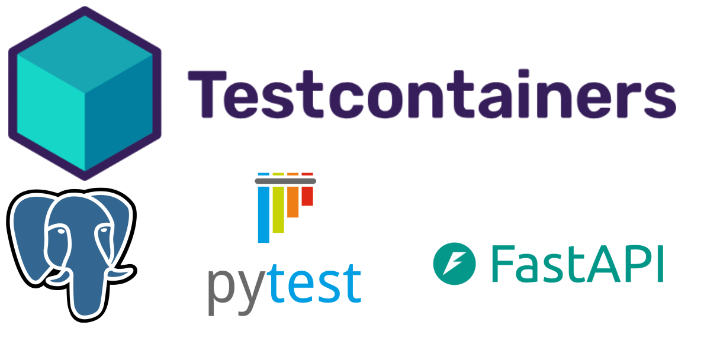

---
hide:
  - navigation
---

# Testcontainers with FastAPI and asyncpg



When I first learned about [testcontainers](https://testcontainers.com/){:target="\_blank"}, I wanted to know how to integrate it with [`asyncpg`](https://magicstack.github.io/asyncpg/current/){:target="\_blank"}, an asynchronous driver for PostgreSQL. At first look, I came across [this text](https://www.linkedin.com/pulse/utilizando-testcontainers-fastapi-guilherme-de-carvalho-carneiro-9cmlf/){:target="\_blank"} from [Guilherme](https://www.linkedin.com/in/guilhermecarvalho/){:target="\_blank"}, who worked on it instantly. Based on that, I decided to write this simple repository with an example application.

You can check the complete repository [here](https://github.com/lealre/fastapi-testcontainer-asyncpg).

TL;DR: The full `conftest.py` setup is available [here](Add link here).

## Testcontainers

Testcontainers is an open-source library for providing lightweight instances of anything that can run in a Docker container. It was originally implemented for .NET, Go, Java, and Node.js, but it was extended to other programming languages through community projects, including Python: [testcontainer-python docs](https://testcontainers-python.readthedocs.io/en/latest/){:target="\_blank"}.

Below is the documentation example of how to use an instance of PostgreSQL, which uses [`psycopg2`](https://github.com/psycopg/psycopg2){:target="\_blank"} as the default driver.

```py
>>> from testcontainers.postgres import PostgresContainer
>>> import sqlalchemy

>>> with PostgresContainer("postgres:16") as postgres:
...    psql_url = postgres.get_connection_url()
...    engine = sqlalchemy.create_engine(psql_url)
...    with engine.begin() as connection:
...        version, = connection.execute(sqlalchemy.text("SELECT version()")).fetchone()
>>> version
'PostgreSQL 16...'
```

## Example setup

The routes of the example will be written using FastAPI and [aiosqlite](https://aiosqlite.omnilib.dev/en/stable/), the async driver to SQLite. To the tests it uses [pytest](https://docs.pytest.org/en/stable/) and [pytest-asyncio](https://pytest-asyncio.readthedocs.io/en/latest/).

Below are all the dependencies used to run the example.

```txt title="requirements.txt"
aiosqlite>=0.20.0
asyncpg>=0.30.0
fastapi[standard]>=0.115.6
pytest>=8.3.4
pytest-asyncio>=0.24.0
sqlalchemy>=2.0.36
testcontainers>=4.8.2
```

The README contains all the steps to run it locally using [uv](https://docs.astral.sh/uv/).

The example repository is structured in the following way:

```yaml
.
├── src # (1)
│   ├── app.py
│   ├── database.py
│   ├── models.py
│   └── schemas.py
└── tests
    ├── conftest.py # (2)
    └── test_routes.py
```

1. Where the example API is written using FastAPI.
2. Where API test fixtures are written, from the PostgreSQL instance to the client. You can learn more about the `conftest.py` file in the <a href="https://docs.pytest.org/en/stable/reference/fixtures.html#conftest-py-sharing-fixtures-across-multiple-files" target="_blank">pytest docs</a>.

## API routes example

To build the API

## Tests with `pytest`

### Conftest setup

### Writing and runnig hte tests
