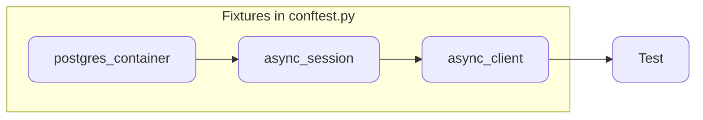

---
hide:
  - navigation
---

# Testcontainers with FastAPI and asyncpg


When I first learned about [testcontainers](https://testcontainers.com/){:target="\_blank"}, I wanted to know how to integrate it with [`asyncpg`](https://magicstack.github.io/asyncpg/current/){:target="\_blank"}, an asynchronous driver for PostgreSQL. At first look, I came across [this text](https://www.linkedin.com/pulse/utilizando-testcontainers-fastapi-guilherme-de-carvalho-carneiro-9cmlf/){:target="\_blank"} from [Guilherme](https://www.linkedin.com/in/guilhermecarvalho/){:target="\_blank"}, who worked on it instantly. Based on that, I decided to write this simple repository with an example application.

You can check the complete repository [here](https://github.com/lealre/fastapi-testcontainer-asyncpg){:target="\_blank"}.

TL;DR: The full `conftest.py` setup is available [here](Add link here).

## Testcontainers

Testcontainers is an open-source library for providing lightweight instances of anything that can run in a Docker container. It was originally implemented for .NET, Go, Java, and Node.js, but it was extended to other programming languages through community projects, including Python: [testcontainer-python docs](https://testcontainers-python.readthedocs.io/en/latest/){:target="\_blank"}.

Below is the documentation example of how to use an instance of PostgreSQL, which uses [`psycopg2`](https://github.com/psycopg/psycopg2){:target="\_blank"} as the default driver.

```py
>>> from testcontainers.postgres import PostgresContainer
>>> import sqlalchemy

>>> with PostgresContainer("postgres:16") as postgres:
...    psql_url = postgres.get_connection_url()
...    engine = sqlalchemy.create_engine(psql_url)
...    with engine.begin() as connection:
...        version, = connection.execute(sqlalchemy.text("SELECT version()")).fetchone()
>>> version
'PostgreSQL 16...'
```

## Context

The objective of this repository is to test asynchronous FastAPI endpoints using an PostgesQL with an asyncrhounous driver. To achive that, besides the testconteiner, it uses [pytest](https://docs.pytest.org/en/stable/){:target="\_blank"} and [pytest-asyncio](https://pytest-asyncio.readthedocs.io/en/latest/){:target="\_blank"}.

The the development of the routes it uses [aiosqlite](https://aiosqlite.omnilib.dev/en/stable/){:target="\_blank"}, the async driver to SQLite.

Below are all the dependencies used to run the example.

```txt title="requirements.txt"
aiosqlite>=0.20.0
asyncpg>=0.30.0
fastapi[standard]>=0.115.6
pytest>=8.3.4
pytest-asyncio>=0.24.0
sqlalchemy>=2.0.36
testcontainers>=4.8.2
```

The README contains all the steps to run it locally using [uv](https://docs.astral.sh/uv/){:target="\_blank"}.

Below is how the example is structured:

```yaml
.
├── src # (1)
│   ├── app.py
│   ├── database.py
│   ├── models.py
│   └── schemas.py
└── tests
    ├── conftest.py # (2)
    └── test_routes.py
```

1. Where the example API is written using FastAPI.
2. Where API test fixtures are written, from the PostgreSQL instance to the client. You can learn more about the `conftest.py` file in the <a href="https://docs.pytest.org/en/stable/reference/fixtures.html#conftest-py-sharing-fixtures-across-multiple-files" target="_blank">pytest docs</a>.

## API routes example

This section will show the endpoints create for later tests. For this example it was created 3 simple routes simulating a ticketing sell system:

- `GET /tickets/all` - To list all the available tickets
- `POST /tickets/create` - To create a new ticket to sell
- `POST /tickets/buy` - To buy an available ticket to sell

In the database, beside the `id` field, the ticket table has: a `price` field; a boolean field `is_sold` to identify if it's sold or not; and a `sold_to` field to identify to who was sold the ticket. The `models.py` file contains these informations, using the [`SQLAlchemy`](https://www.sqlalchemy.org/){:target="\_blank"} ORM.

```py title="src/models.py" linenums="1"
from sqlalchemy.orm import Mapped, mapped_column, registry

table_register = registry()


@table_register.mapped_as_dataclass
class Ticket:
    __tablename__ = 'tickets'

    id: Mapped[int] = mapped_column(init=False, primary_key=True)
    price: Mapped[int]
    is_sold: Mapped[bool] = mapped_column(default=False)
    sold_to: Mapped[str] = mapped_column(nullable=True, default=None)
```

The `database.py` contains the connection with the database, as also the `get_session()` generator, responsible for creating asynchronous sessions for performing transactions in the database.

```python title="src/database.py" linenums="1"
import typing

from sqlalchemy.ext.asyncio import (
    AsyncSession,
    async_sessionmaker,
    create_async_engine,
)

DATABASE_URL = 'sqlite+aiosqlite:///db.sqlite3'

engine = create_async_engine(DATABASE_URL, future=True, echo=True)

AsyncSessionLocal = async_sessionmaker(
    autocommit=False,
    expire_on_commit=False,
    autoflush=True,
    bind=engine,
    class_=AsyncSession,
)


async def get_session() -> typing.AsyncGenerator[AsyncSession, None]:
    async with AsyncSessionLocal() as session:
        yield session
```

The last file before to create the routes is the `schemas.py`, that will contain all the [pydantic](https://docs.pydantic.dev/latest/){:target="\_blank"} models.

```py title="src/schemas.py" linenums="1"
from pydantic import BaseModel


class TicketBase(BaseModel):
    price: int
    is_sold: bool = False
    sold_to: str | None = None


class TicketResponse(TicketBase):
    id: int


class TicketRequestCreate(TicketBase):
    pass


class TicketRequestBuy(BaseModel):
    ticket_id: int
    user: str


class ListTickets(BaseModel):
    tickets: list[TicketResponse]
```

The previous three files are imported in `app.py`, that contains the API routes for this example. As mentioned before, although the objective is to test the endpoints in a PostgreSQL database, the development of the API is done by using SQLite to avoid the necessity to have an instance of PostgreSQL running all the time.

To keep it simple and avoid using database migrations, the database creation is handled using the [lifespan events](https://fastapi.tiangolo.com/advanced/events/){:target="\_blank"}. Here, it will just guarantee that every time we run the application, a database will be created in case it's not yet.

```py title="src/app.py" linenums="1" hl_lines="18-24"
from contextlib import asynccontextmanager
from http import HTTPStatus
from typing import Annotated

from fastapi import Depends, FastAPI, HTTPException
from sqlalchemy import and_, select, update

from src.database import AsyncSession, engine, get_session
from src.models import Ticket, table_register
from src.schemas import (
    ListTickets,
    TicketRequestBuy,
    TicketRequestCreate,
    TicketResponse,
)


@asynccontextmanager
async def lifespan(app: FastAPI):
    async with engine.begin() as conn:
        await conn.run_sync(table_register.metadata.create_all)
        yield
    await engine.dispose()


app = FastAPI(lifespan=lifespan)
```

Below are the routes implementation, as also the `SessionDep` to be used as [dependency injection](https://fastapi.tiangolo.com/tutorial/dependencies/){:target="\_blank"} in each route.

```py title="src/app.py" linenums="27" hl_lines="3"
...

SessionDep = Annotated[AsyncSession, Depends(get_session)]


@app.get('/tickets/all', response_model=ListTickets)
async def get_all_tickets(session: SessionDep):
    async with session.begin():
        tickets = await session.scalars(select(Ticket))

    all_tickets = tickets.all()

    return {'tickets': all_tickets}


@app.post(
    '/tickets/create',
    response_model=TicketResponse,
    status_code=HTTPStatus.CREATED,
)
async def create_ticket(session: SessionDep, ticket_in: TicketRequestCreate):
    new_ticket = Ticket(**ticket_in.model_dump())

    async with session.begin():
        session.add(new_ticket)
        await session.commit()

    async with session.begin():
        await session.refresh(new_ticket)

    return new_ticket


@app.post('/tickets/buy', response_model=TicketResponse)
async def get_ticket_by_id(session: SessionDep, ticket_in: TicketRequestBuy):
    async with session.begin():
        ticket_db = await session.scalar(
            select(Ticket).where(Ticket.id == ticket_in.ticket_id)
        )

    if not ticket_db:
        raise HTTPException(
            status_code=HTTPStatus.NOT_FOUND, detail='Ticket was not found'
        )

    async with session.begin():
        stm = (
            update(Ticket)
            .where(
                and_(
                    Ticket.id == ticket_in.ticket_id,
                    Ticket.is_sold == False,  # noqa: E712
                )
            )
            .values(is_sold=True, sold_to=ticket_in.user)
        )

        ticket_updated = await session.execute(stm)

        if ticket_updated.rowcount == 0:
            raise HTTPException(
                status_code=HTTPStatus.CONFLICT,
                detail='Ticket has already been sold',
            )

        await session.commit()

    async with session.begin():
        await session.refresh(ticket_db)

    return ticket_db

```

Now, running the command below in the terminal, the application should be available at `http://127.0.0.1:8000`.

```bash
fastapi dev src/app.py
```

## Tests workflow

To use PostgeSQL in the tests, the testcontainer will be setup in the `conftest.py`, as also the database session and the client to be used to test our endpoints.

Below is a asimple schem of how it will work for each tests, where each block will represent a different function.



As we are working with the async fistures, all the funtion will have the decorator `@pytest_asyncio.fixture` assigned.

## Creating the test fixtures

The `postgres_container` function will create the PostgreSQL intsnace and provide the database URL to be connected in the `async_session` funtion.

```py title="tests/conftest.py" linenums="1" hl_lines="15-18"
import pytest_asyncio
from httpx import ASGITransport, AsyncClient
from sqlalchemy.ext.asyncio import (
    AsyncSession,
    async_sessionmaker,
    create_async_engine,
)
from testcontainers.postgres import PostgresContainer

from src.app import app
from src.database import get_session
from src.models import table_register


@pytest_asyncio.fixture
def postgres_container():
    with PostgresContainer('postgres:16', driver='asyncpg') as postgres:
        yield postgres
```

In `async_session`, it takes the url connection from the PostgresContainer object, and use it to cretae the tables inside the Database, as also the session that will establishe all conversations with the POstgreSQl instance created. The function will persist this session to be used in `async_client`, and them restarte the database to the next test.

```py title="tests/conftest.py" linenums="21"
@pytest_asyncio.fixture
async def async_session(postgres_container: PostgresContainer):
    async_db_url = postgres_container.get_connection_url()
    async_engine = create_async_engine(async_db_url, pool_pre_ping=True)

    async with async_engine.begin() as conn:
        await conn.run_sync(table_register.metadata.drop_all)
        await conn.run_sync(table_register.metadata.create_all)

    async_session = async_sessionmaker(
        autoflush=False,
        bind=async_engine,
        class_=AsyncSession,
        expire_on_commit=False,
    )

    async with async_session() as session:
        yield session

    await async_engine.dispose()
```

The `async_client` function will create the [`AsyncClient`](https://fastapi.tiangolo.com/advanced/async-tests/), directly importted from [`HTTPX`](https://www.python-httpx.org/), and provide it to get reqeusts from our endpoints. Here, the session provided by `async_session` wil overrides the session originally used in our app as dependencie injection while the client is being used.

```py title="tests/conftest.py" linenums="43"
@pytest_asyncio.fixture
async def async_client(async_session: async_sessionmaker[AsyncSession]):
    app.dependency_overrides[get_session] = lambda: async_session
    _transport = ASGITransport(app=app)

    async with AsyncClient(
        transport=_transport, base_url='http://test', follow_redirects=True
    ) as client:
        yield client

    app.dependency_overrides.clear()
```

## Running the tests

## The pytest scope

## Final `conftest.py`

## Conclusion

ERROR tests/test_routes.py::test_get_all_tickets_success - docker.errors.DockerException: Error while fetching server API version: ('Connection aborted.', FileNotFoundError(2, 'No such file or directory'))
